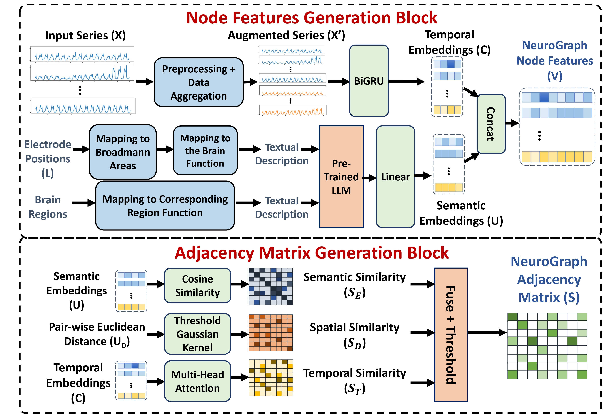
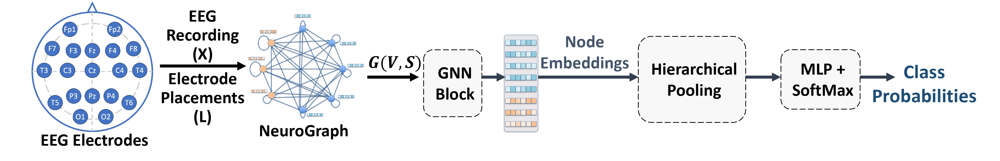

# Dynamic GNNs for Precise Seizure Detection and Classification from EEG Data


Arash Hajisafi, Haowen Lin, Yao-Yi Chiang, and Cyrus Shahabi. "Dynamic GNNs for Precise Seizure Detection and Classification from EEG Data." In *Pacific-Asia Conference on Knowledge Discovery and Data Mining*, pp. 207-220. Singapore: Springer Nature Singapore, 2024. https://arxiv.org/abs/2405.09568
___


  
This repository hosts the implementation of NeuroGNN, a dynamic Graph Neural Network (GNN) framework introduced in our paper "Dynamic GNNs for Precise Seizure Detection and Classification from EEG Data", accepted at PAKDD '24. Our framework is designed to enhance seizure detection and classification through the capture of EEG data's spatial, temporal, semantic, and taxonomic correlations.


## Table of Contents
- [NeuroGNN Overview](#neurognn-overview)
- [Installation](#installation)
- [Data](#data)
- [Data Preprocessing](#data-preprocessing)
- [Training](#training)
  - [Seizure Detection](#seizure-detection)
  - [Seizure Type Classification](#seizure-type-classification)
  - [Self-Supervised Pre-Training](#self-supervised-pre-training)
  - [Fine-Tuning](#fine-tuning-for-seizure-detection--seizure-type-classification)
- [Pretrained Models](#pretrained-models)
- [Citation](#citation)
- [License](#license)


## NeuroGNN Overview

NeuroGNN captures the dynamic interplay between EEG electrode locations and the semantics of their corresponding brain regions, leveraging the intricate relationships governed by each brain region's distinct cognitive functions and sensory processing. This multifaceted approach allows for a comprehensive understanding of brain activity, leading to improved precision in seizure detection and classification.

<p align="center">
  
  <br>
  <em>Figure 1: NeuroGNN Graph Construction - Fusing spatial, temporal, semantic, and taxonomic correlations.</em>
</p>

<p align="center">
  
  <br>
  <em>Figure 2: Seizure Detection & Classification Using NeuroGNN.</em>
</p>


The `constants.py` file contains important descriptions and mappings, including the textual descriptions for brain regions and Brodmann areas used to generate semantic embeddings, and the mapping from EEG electrodes to these areas and regions. Our paper provides further details on how these elements are utilized within the NeuroGNN framework.

## Acknowledgments

This project is forked from the repository of "Self-Supervised Graph Neural Networks for Improved Electroencephalographic Seizure Analysis" by Siyi Tang et al. We reuse portions of their code, including pre-processing scripts, training loops, and evaluation codes. Additionally, the sections of this documentation related to dataset preparation and preprocessing are based on their comprehensive documentation. Check out their [original work](https://github.com/tsy935/eeg-gnn-ssl), licensed under the MIT License.


## Installation

To install the required dependencies for NeuroGNN, follow these steps:

1. Clone the NeuroGNN repository
```bash
git clone https://github.com/USC-InfoLab/NeuroGNN.git
```

2. Navigate to the NeuroGNN directory
```bash
cd NeuroGNN
 ```

3. Install the required Python packages
```bash
pip install -r requirements.txt
```

## Data

We use the Temple University Seizure Corpus (TUSZ) v1.5.2 in this study. The TUSZ dataset is publicly available [here](https://www.kaggle.com/datasets/psyryuvok/the-tuh-eeg-seizure-corpus-tusz-v152). After you have registered and downloaded the data, you will see a subdirectory called `edf` which contains all the EEG signals and their associated labels. We use the EEG files in the `edf/dev` subfolder as our held-out test set. We further split the EEG files in the `edf/train` subfolder into train and validation sets by patients. See folders `./data/file_markers_detection`, `./data/file_markers_classification`, and `./data/file_markers_ssl` for details.

In this study, we exclude five patients from the test set who exist in both the official TUSZ train and test sets. You can find the list of excluded patients' IDs in `./data_tusz/excluded_test_patients.txt`.

In addition, `./data_tusz/focal_labeled_as_generalized.csv` provides the list of 27 seizures in the test set that we think are **focal seizures** (manually analyzed by a board-certified EEG reader) but are labeled as **generalized non-specific seizures** in TUSZ data. See the paper by [Tang et al.](https://github.com/tsy935/eeg-gnn-ssl) for more details.


## Data Preprocessing
The preprocessing step resamples all EEG signals to 200Hz, and saves the resampled signals in 19 EEG channels as `h5` files.

On terminal, run the following:
```bash
python ./data/resample_signals.py --raw_edf_dir <tusz-data-dir> --save_dir <resampled-dir>
```
where `<tusz-data-dir>` is the directory where the downloaded TUSZ v1.5.2 data are located, and `<resampled-dir>` is the directory where the resampled signals will be saved.

### Optional Preprocessing
Note that the remaining preprocessing step in our paper  (Fourier transform on short sliding windows) is handled by dataloaders. You can (optionally) perform this preprocessing step prior to model training to accelerate the training.

Preprocessing for seizure detection and self-supervised pre-training:
```bash
python ./data/preprocess_detection.py --resampled_dir <resampled-dir> --raw_data_dir <tusz-data-dir> --output_dir <preproc-dir> --clip_len <clip-len> --time_step_size 1 --is_fft
```
where `<clip-len>` is 60 or 12.

Preprocessing for seizure classification:
```bash
python ./data/preprocess_classification.py --resampled_dir <resampled-dir> --raw_data_dir <tusz-data-dir> --output_dir <preproc-dir> --clip_len <clip-len> --time_step_size 1 --is_fft
```

## Training

### Optional: Logging with Weights & Biases

For those interested in tracking and visualizing their training experiments, you can optionally log your results to Weights & Biases. If you don't have a wandb account, you can create one at [wandb.ai](https://wandb.ai/site). To enable wandb logging, add the `--use_wandb` flag to your training commands. This is entirely optional and can be omitted if you prefer not to use wandb.


### Seizure Detection
To train seizure detection from scratch using **NeuroGNN**, run: 
```bash
python train.py --input_dir <resampled-dir> --raw_data_dir <tusz-data-dir> --save_dir <save-dir> --max_seq_len <clip-len> --do_train --num_epochs 100 --task detection --metric_name auroc --use_fft --lr_init 1e-4 --num_classes 1 --data_augment --model_name neurognn
```
where `<clip-len>` is 60 or 12.

To use preprocessed Fourier transformed inputs from the above optional preprocessing step, specify `--preproc_dir <preproc-dir>`.


### Seizure Type Classification
To train seizure type classification from scratch using **NeuroGNN**, run: 
```bash
python train.py --input_dir <resampled-dir> --raw_data_dir <tusz-data-dir> --save_dir <save-dir> --max_seq_len <clip-len> --do_train --num_epochs 60 --task classification --metric_name F1 --use_fft --lr_init 2e-4 --num_classes 4 --data_augment --dropout 0.5 --model_name neurognn
```
Similarly, `<clip-len>` is 60 or 12. To use preprocessed Fourier transformed inputs from the above optional preprocessing step, specify `--preproc_dir <preproc-dir>`.


### Self-Supervised Pre-Training
To train self-supervised next time period prediction using **NeuroGNN**, run: 
```bash
python train_ssl.py --input_dir <resampled-dir> --raw_data_dir <tusz-data-dir> --save_dir <save-dir> --max_seq_len <clip-len> --output_seq_len 12 --do_train --num_epochs 350 --task 'SS pre-training' --metric_name loss --use_fft --lr_init 5e-4 --data_augment --model_name neurognn
```
Similarly, `<clip-len>` is 60 or 12. To use preprocessed Fourier transformed inputs from the above optional preprocessing step, specify `--preproc_dir <preproc-dir>`.


### Fine-Tuning for Seizure Detection & Seizure Type Classification
To fine-tune seizure detection/seizure type classification models from self-supervised pre-training, **add** the following additional arguments:
```bash
--fine_tune --load_model_path <pretrained-model-checkpoint>
```

## Pretrained Models

We provide pretrained checkpoints for seizure detection, classification, and self-supervised learning tasks. These models are available in the [`neurognn_checkpoints`](neurognn_checkpoints) directory of our repository. You can leverage these models to kickstart your research or applications related to EEG data analysis.


## Citation

If you find our work useful, please consider citing:
```
@inproceedings{hajisafi2024dynamic,
  title         =  {Dynamic GNNs for Precise Seizure Detection and Classification from EEG Data},
  author        =  {Hajisafi, Arash and Lin, Haowen and Chiang, Yao-Yi and Shahabi, Cyrus},
  booktitle     =  {Pacific-Asia Conference on Knowledge Discovery and Data Mining},
  pages         =  {207--220},
  year          =  {2024},
  organization  =  {Springer}
}
```

## License

This project is licensed under the MIT License - see the [LICENSE](LICENSE) file for details.

<p align="center">
  <a href="./LICENSE"></a>
  <a href="https://hits.seeyoufarm.com"></a>
</p>
